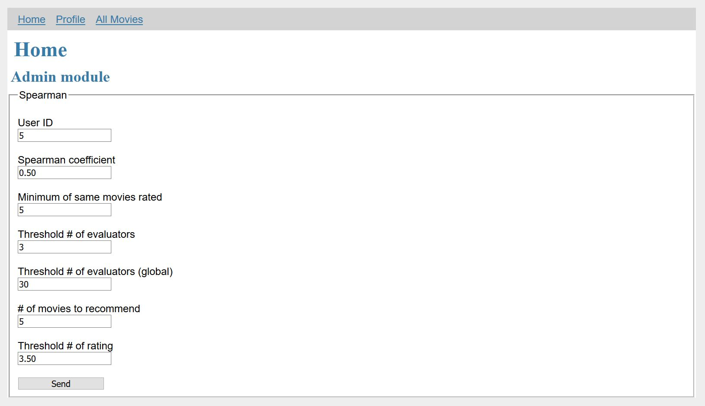

# BI-VWM-2019

Recommendation system based on collaborative filtering. For correlation was used Spearman correlation coefficient.
Used dataset is small [MovieLens](http://movielens.org) dataset (with 100 000 records, original has 10 millions).
Backend is written in Python and has webpage GUI frontend made in Flask(python web framework).

Installations for frontend
---

    cd frontend
    python3 -m venv venv
    ./venv/bin/activate (pripdne chmod +x activate)
    pip install Flask
    pip install Flask-WTF
    
in case of error: `No module named "flask_wtf"` install "Flask WTF" through IDE (or other means).
   
Run program
---

    chmod +x ./run.sh
    ./run.sh
    
or

    python3 ./run.py    

Program will run in debug mode.

Web GUI:
---
Chosing User and recommend parameters:

Result recommendation for that User:
